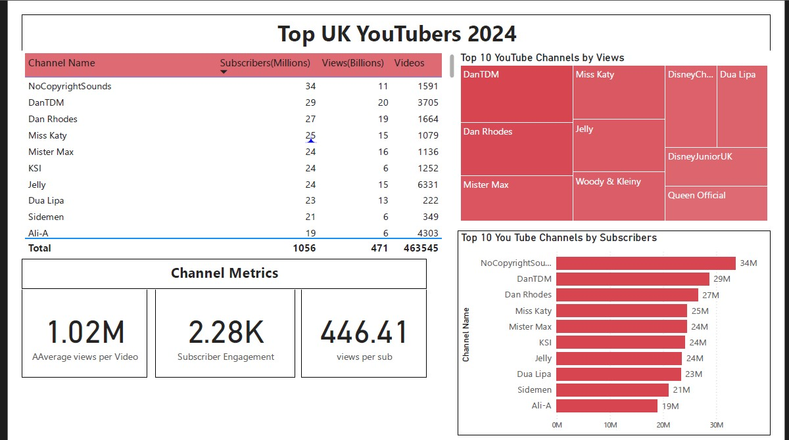
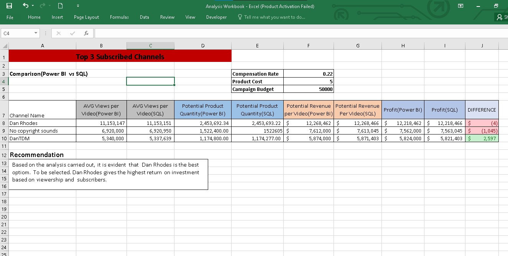

# Data Analysis Portfolio
    Excel to SQL to Power BI 


    
# Table of contents 
- [Introduction](#introduction)
    - [Objective](#objective)
    - [Key Questions](#Key_Questions)
- [Data Sources](#data_sources)
- [Data Analysis](#data_analysis)
    - [Procedure](#Procedure)
    - [Visuals](#Visuals)
 
- [Recommendations](#Recommendations)


# Introduction

# Objective
- Main Objective

The Marketing Director aims to identify leading YouTubers in 2024 for potential collaboration on marketing campaigns for the year.


# Key_Questions
1. Who are the top 10 YouTubers with the most subscribers?
2. Which 3 channels have uploaded the most videos?
3. Which 3 channels have the most views?
4. Which 3 channels have the highest average views per video?
5. Which 3 channels have the highest views per subscriber ratio?
6. Which 3 channels have the highest subscriber engagement rate per video uploaded?
 

# Data_Sources
- The data is sourced from Kaggle (an Excel extract), [see here to find it.](https://www.kaggle.com/datasets/bhavyadhingra00020/top-100-social-media-influencers-2024-countrywise?resource=download)

- Variables used for Analysis :
    - channel names
    - total subscribers
    - total views
    - total videos uploaded
 
 
# Data_analysis

## Tools 


| Tool | Purpose |
| --- | --- |
| Excel | Exploring and cleaning the data |
| SQL Server | Testing and analyzing the data |
| Power BI | Visualizing the data via interactive dashboards |
| GitHub | Hosting the project documentation and version control |


# Procedure
1. Get the data
2. Explore  data in Excel
3. Load and clean data in SQL Server
4. Test the data with SQL
5.Load and  Visualize the data in Power BI
6. Generate  findings based on the insights
7. Design Recommendations
8. Publish the data to GitHub Pages


## Data Cleaning and Testing using SQL

``` sql
SELECT * FROM youtube_python;

-- A. DATA CLEANING STEPS 
-- 1. Extract You tube Channel name  from first column
-- 2. Remove unnessesary columns
-- 3. Rename columns appropriately

--  Columns to be used
SELECT 
	NOMBRE,
    total_subscribers,
    total_views,
    total_videos
FROM youtube_python;

-- Extract youtube Channel
ALTER Table youtube_python ADD COLUMN Channel_Name VARCHAR(50) NOT NULL AFTER NOMBRE;
UPDATE youtube_python
	SET  Channel_Name = substring_index(NOMBRE,'@', 1);
  
  
  -- Create view with relevant columns
  CREATE VIEW UK_DATA_VIEW AS  
	SELECT 
	Channel_Name,
    total_subscribers,
    total_views,
    total_videos
FROM youtube_python ;


-- B. TEST DATA
SELECT * FROM  uk_data_view;
-- QUALITY DATA -Clean and Accurate, no missing vakues, no errors and wrong charecters
-- Check for DUPLICATES 
-- Expectation from Data
	-- 100 channels
	-- 4 Fields needed(Column Test)
    -- Field Data Type
		-- Name - String -
        -- Subscribers - INT
        -- Videos - INT 
        -- Views - int
        
-- Check Data Type     
DESCRIBE uk_data_view ;   

-- Check Row count 
SELECT COUNT(Channel_Name) AS Name, COUNT(total_subscribers) AS Subs, COUNT(total_views) AS Views, COUNT(total_videos) AS Videos FROM uk_data_view;

-- Check For Duplicates 
SELECT Channel_Name,
	Count(Channel_Name) AS name_count
FROM uk_data_view
    GROUP BY Channel_Name
    having name_count > 1;
  ```
# Visuals
[Power BI Dashboard](assets/Power BI Dashboard/You Tube Dashboard.pbix)


We discovered that :
1. NoCopyrightSOunds, Dan Rhodes and DanTDM are the channnels with the most subscribers in the UK
2. GRM Daily, Man City and Yogscast are the channels with the most videos uploaded
3. DanTDM, Dan RHodes and Mister Max are the channels with the most views
4. Entertainment channels are useful for broader reach, as the channels posting consistently on their platforms and generating the most engagement are focus on entertainment and music 


# Recommendations
1. Top Collaboration Choices: NoCopyrightSounds, DanTDM, and Dan Rhodes are recommended for partnerships as they consistently drive the highest engagement on their channels.
2. Dan Rhodes: Ideal for maximizing visibility and investmrnt return due to having the highest subscriber count and high viewership .
3. Mister Max: Offers the greatest reach; however, DanTDM and Dan Rhodes could provide better long-term value due to their substantial and actively engaged subscriber bases.


## Expected return on Investmrnt

| Channel Name | Profit |
|----|----|
|Dan Rhodes|12,218,462|
|No copyright sounds|7,562,000|
|DanTDM|5,824,000|


    
    
    
    
    
    


 
  


  
